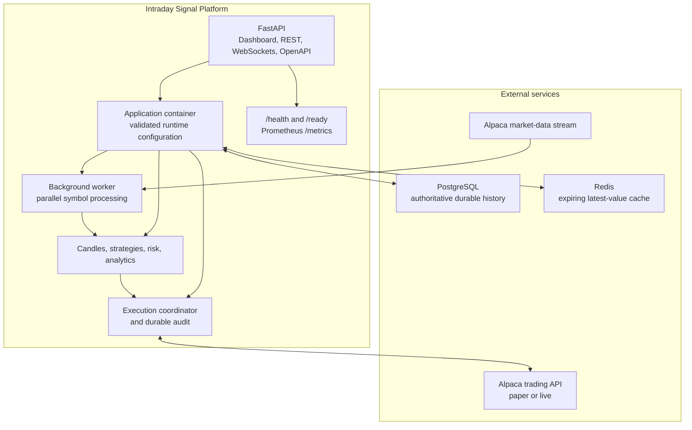
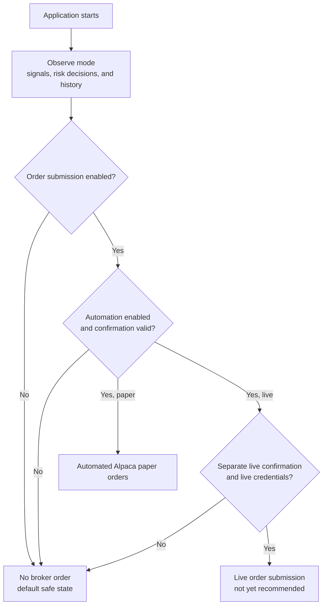
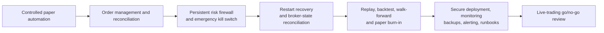

# Intraday Signal Platform

> A configuration-driven Python backend for US-equities market data, strategy evaluation, portfolio risk controls, and guarded Alpaca execution.

## Status

**Paper-trading control center: ready for controlled operation.**

The application can stream Alpaca market data, build candles, run the EMA crossover strategy, apply portfolio-aware risk controls, record every decision, and submit paper orders only after explicit configuration gates are enabled. It is intentionally **not yet approved for unattended live trading**; the remaining live-readiness work is documented below.

The application now includes a same-origin local dashboard for the watchlist, historical prices, signals, account/position snapshots, execution audit, and safe runtime controls. REST, WebSockets, Prometheus metrics, Docker health probes, and the Alpaca paper dashboard remain available for operational use.

## What the application does today

| Area | Current capability |
| --- | --- |
| Market data | Streams Alpaca quotes and trades, validates normalized ticks, and persists them. |
| Candles | Builds XNYS-session-aware candles from `1m` to monthly intervals; provider history is preferred and tick aggregation is a safe fallback. |
| Strategy | Runs plugin-style strategies. EMA crossover is the first production strategy and evaluates completed candles only. |
| Risk | Sizes entries from ATR, prevents averaging down, limits loss streaks, daily loss, gross exposure, open positions, and cash-reserve breaches. |
| Execution | Uses an idempotent, provider-neutral execution boundary with a guarded Alpaca paper/live adapter. Automated entry and exit logic is available but disabled by default. |
| Control plane | Persists versioned watchlist, EMA, risk, monitoring, mode, and automatic-order choices; updates are audited and protected by optimistic concurrency. |
| Dashboard | Serves a responsive local browser view at `/` without a separate frontend service or build tool. |
| Storage | PostgreSQL is the durable record for market data, signals, outcomes, account/position snapshots, and execution audit records. Redis caches reconstructible latest values only. |
| Observability | REST, WebSockets, request/correlation IDs, structured logs, Prometheus metrics, liveness, and dependency readiness checks. |
| Deployment | Docker Compose runs API + Redis and connects to an externally managed PostgreSQL instance. |

## From market event to broker order

```mermaid
flowchart LR
    Data["Alpaca market data\ntrades and quotes"] --> Provider["Provider adapter\nnormalized ticks"]
    Provider --> Pipeline["Symbol-sharded worker pipeline"]
    Pipeline --> Candle["XNYS candle engine\ncompleted candles only"]
    Candle --> Strategy["Strategy registry\nEMA crossover"]
    Strategy --> Intent["Signal intent\nBUY, EXIT, or HOLD"]
    Intent --> Risk["Portfolio risk engine\nATR sizing and hard limits"]
    Risk -->|approved| Audit["Idempotency and audit store"]
    Audit -->|automation explicitly enabled| Broker["Alpaca execution provider"]
    Risk -->|rejected| Events["Signal history and WebSocket event"]
    Broker --> Portfolio["Account, positions, orders\nPostgreSQL snapshots"]
    Pipeline --> Events
    Events --> API["REST, WebSocket, and dashboard APIs"]
```



The strategy never evaluates an in-progress candle. The tick processor rejects timestamp-regressing events, and the order path is blocked unless every safety gate is satisfied.

## Runtime architecture



PostgreSQL is the source of truth. Losing Redis does not discard trading history; it only removes cached latest tick/candle values.

## Trading modes and safeguards



Paper automation requires all of the following:

```dotenv
TRADING_TRADING_MODE=paper
TRADING_ORDER_SUBMISSION_ENABLED=true
TRADING_AUTOMATION_ENABLED=true
TRADING_AUTOMATION_CONFIRMATION=ENABLE_PAPER_AUTOMATION
TRADING_SYMBOLS=AAPL,MSFT
```

Live mode uses separate Alpaca credentials and also requires the explicit `ENABLE_LIVE_TRADING` and `ENABLE_LIVE_AUTOMATION` confirmations. Keep automation disabled while validating a configuration.

## Quick start

### Prerequisites

- Python 3.12
- [uv](https://docs.astral.sh/uv/)
- Docker Desktop for the containerized stack
- PostgreSQL, managed outside Docker (for example through local pgAdmin)
- Redis is started by Docker Compose

### Run locally

```powershell
uv sync --all-groups --python 3.12
uv run --python 3.12 uvicorn api.app:app --host 127.0.0.1 --port 8000
```

### Run with Docker

```powershell
Copy-Item .env.example .env
# Fill in PostgreSQL and Alpaca values in .env. Never commit this file.
docker compose up --build --detach
```

Docker exposes the API on port `8000` and Redis on port `6379`. The API applies Alembic migrations at startup. For a PostgreSQL instance running on the host, use `host.docker.internal` in `TRADING_DATABASE_URL` so the container can reach it.

### Confirm the running system

```powershell
Invoke-RestMethod http://localhost:8000/health
Invoke-RestMethod http://localhost:8000/ready
Invoke-RestMethod http://localhost:8000/trading/status
Invoke-RestMethod http://localhost:8000/trading/account
```

`/health` is a liveness check. `/ready` verifies the application, market-data provider, worker pipeline, PostgreSQL, and Redis; Docker uses it as its health check.

Open these URLs after startup:

- Interactive API: http://localhost:8000/docs
- Trading dashboard: http://localhost:8000/
- Health: http://localhost:8000/health
- Readiness: http://localhost:8000/ready
- Metrics: http://localhost:8000/metrics

## API and live events

| Surface | Purpose |
| --- | --- |
| `GET /market/status` | Provider connection and environment. |
| `POST /market/ticks` | Route a normalized tick through the same pipeline used by background workers. |
| `GET /market/ticks/latest/{symbol}` | Latest persisted tick. |
| `GET /market/candles/latest/{symbol}?interval=1m` | Latest active or completed candle. |
| `GET /market/candles/{symbol}` | Historical Alpaca candles, with safe tick aggregation fallback. |
| `POST /signals/generate`, `GET /signals` | Create and inspect risk-managed signal decisions. |
| `POST /analytics/outcomes`, `GET /analytics` | Record closed outcomes and retrieve performance analytics. |
| `GET /trading/status` | Effective provider, mode, configured symbols, and safety gates. |
| `GET /trading/account`, `/trading/positions`, `/trading/orders` | Broker account state, current holdings, and durable execution audit history. |
| `GET/PUT /control`, `GET /control/audit` | Read or safely apply the durable operator configuration and inspect its audit history. |
| `GET /metrics` | Prometheus metrics. |
| `GET /health`, `GET /ready` | Liveness and dependency readiness. |

WebSocket subscriptions use one topic per socket:

| URL | Events |
| --- | --- |
| `ws://localhost:8000/ws/ticks` | Accepted ticks from REST or the background pipeline. |
| `ws://localhost:8000/ws/candles` | Candle updates and completed candles. |
| `ws://localhost:8000/ws/signals` | Risk decisions and generated signals. |
| `ws://localhost:8000/ws/analytics` | Updated analytics snapshots. |

Every event uses this envelope:

```json
{
  "event": "tick",
  "data": {}
}
```

## Configuration

Copy `.env.example` to `.env`. All non-secret behavior is driven through `TRADING_` settings, including providers, mode, symbols, intervals, strategy parameters, worker concurrency, and risk limits.

Use `.env` only for local development and secrets. It is intentionally ignored by Git. The tracked `.env.example` contains placeholders only.

Important values:

| Setting | Purpose |
| --- | --- |
| `TRADING_MARKET_DATA_PROVIDER=alpaca` | Use Alpaca instead of the deterministic mock market-data provider. |
| `TRADING_EXECUTION_PROVIDER=alpaca` | Use Alpaca account/position/order operations. |
| `TRADING_ALPACA_DATA_FEED=iex` | Select the available Alpaca equities data feed. |
| `TRADING_ALPACA_LIVE_API_KEY`, `TRADING_ALPACA_LIVE_API_SECRET` | Separate live pair required before the dashboard can switch the Alpaca execution adapter to live mode. |
| `TRADING_SYMBOLS=AAPL,MSFT` | Symbols monitored by the background pipeline. |
| `TRADING_STRATEGY_INTERVAL=1m` | EMA strategy candle interval. |
| `TRADING_STORAGE_BACKEND=postgres` | Use durable PostgreSQL stores instead of in-memory development stores. |
| `TRADING_ORDER_SUBMISSION_ENABLED=false` | Master gate for any broker order. |
| `TRADING_AUTOMATION_ENABLED=false` | Master gate for automatic execution. |

Alpaca market data and execution are swappable provider implementations; mock providers remain available for deterministic local testing. The live data adapter waits for a contemporaneous quote before turning a trade into a tick, so it never invents bid/ask values. [Alpaca live stock-data SDK documentation](https://alpaca.markets/sdks/python/api_reference/data/stock/live.html)

## What is still required before actual live-market trading

The platform can switch to live mode only after a separate live credential pair and explicit dashboard confirmations are provided, but enabling live orders now would be premature. Complete these items first.



### Live-trading blockers

- [ ] **Order lifecycle management:** continuously reconcile submitted, partial, filled, canceled, rejected, and replaced orders with Alpaca.
- [ ] **Broker-side protection:** submit and maintain bracket/OCO stop-loss and take-profit orders. The risk engine calculates risk levels today, but entries are currently market orders.
- [ ] **Persistent risk firewall:** add an independent kill switch, per-order notional/quantity caps, price collars, symbol allowlists, stale-data protection, and a complete daily realized/unrealized P&L ledger.
- [ ] **Restart recovery:** restore indicator state, candles, portfolio state, and pending order state safely after deployment or failure.
- [ ] **Execution-quality validation:** build deterministic replay/backtesting, transaction costs, spread, slippage, latency, partial-fill, and market-outage simulations.
- [ ] **Operational resilience:** reconnect/backoff logic, rate-limit handling, market-session guardrails, alerts, and failure escalation.
- [ ] **Secure deployment:** authentication for REST/WebSocket APIs, TLS, a secret manager, private networking, database backup/restore drills, and role-based operational access.
- [ ] **Production topology:** split API, market-data, execution, and scheduler responsibilities; ensure only one execution owner can submit orders.
- [ ] **Governance:** document change approval, test evidence, limits, incident procedures, and audit retention. If this becomes a customer-facing or broker/dealer product, obtain specialist legal and compliance advice.

Alpaca paper trading is valuable, but it is still a simulation and does not model all real-world execution effects such as market impact, latency slippage, or queue position. [Alpaca paper-trading documentation](https://docs.alpaca.markets/us/docs/paper-trading)

## Development and verification

```powershell
uv run ruff check .
uv run pytest
uv build
uv run alembic upgrade head --sql
```

The automated suite currently covers configuration validation, control-plane confirmations/auditing, dashboard asset delivery, runtime watchlist reconfiguration, market-data normalization, candle aggregation/history, provider contracts, EMA strategy behavior, risk controls, analytics, execution guards, durable repositories, REST workflows, WebSockets, request correlation, readiness, and worker processing.

For the containerized environment:

```powershell
docker compose up --build --detach
docker compose ps
Invoke-RestMethod http://localhost:8000/ready
```

Stop local containers with `docker compose down`. Use `docker compose down -v` only when deliberately discarding the Redis cache volume; it does not remove the externally managed PostgreSQL database.
