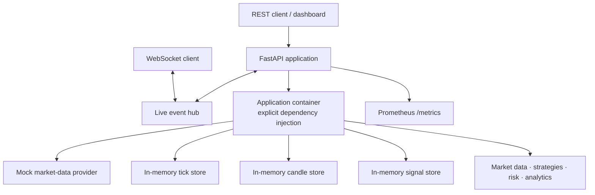

# Intraday Signal Platform

A Python 3.12 FastAPI foundation for generating, risk-checking, and observing US equities trading signals. It is deliberately **signal-only**: it does not submit, modify, or manage broker orders.

The running service uses a deterministic mock market-data provider and bounded in-memory stores. That makes the platform safe to develop and test locally without market-data or broker credentials.

## What it does today

- Normalizes, validates, and stores timestamp-aware market ticks.
- Aggregates XNYS-session candles from `1m` through monthly intervals.
- Prefers provider candle history and safely falls back to tick aggregation.
- Runs isolated strategy plugins; EMA crossover is the first concrete strategy.
- Converts directional intents into ATR-based, position-sized proposals with hard loss limits.
- Calculates realized-outcome analytics after an explicitly supplied close.
- Exposes REST endpoints, interactive OpenAPI documentation, Prometheus metrics, and WebSocket topics.

## Signal lifecycle

```mermaid
flowchart LR
    A["Market tick"] --> B["Tick processor\nvalidate · normalize · order check"]
    B --> C["XNYS candle engine\ncompleted-candle aggregation"]
    C --> D["Strategy engine\nEMA crossover"]
    D --> E["Strategy intent\nBUY · SELL · EXIT · HOLD"]
    E --> F["Risk engine\nATR stop · sizing · daily limits"]
    F --> G["Risk-managed signal\nno order execution"]
    G --> H["Signal history + REST/WebSocket"]
    H --> I["Explicit closed outcome"]
    I --> J["Analytics\nP&L · drawdown · R multiples"]
```



The candle engine only updates strategies from completed candles. The tick processor rejects timestamp-regressing events by default, and the risk engine blocks averaging down, daily-loss breaches, and consecutive-loss breaches.

## Application architecture



The application container owns all runtime dependencies. There is no global connection manager or global domain state, so test applications are isolated from one another.

## Quick start

Prerequisites: [uv](https://docs.astral.sh/uv/) and Python 3.12. The project lockfile pins all Python dependencies.

```powershell
uv sync --all-groups --python 3.12
uv run --python 3.12 uvicorn api.app:app --host 127.0.0.1 --port 8000
```

Open these URLs once the server starts:

- Interactive API: http://127.0.0.1:8000/docs
- Health: http://127.0.0.1:8000/health
- Prometheus metrics: http://127.0.0.1:8000/metrics

### Verify the service

```powershell
Invoke-WebRequest -UseBasicParsing http://127.0.0.1:8000/health
```

Expected response:

```json
{"status":"ok"}
```

## Docker

Copy the environment template and start the containerized API:

```powershell
Copy-Item .env.example .env
docker compose up --build
```

The API is available on port `8000`. Docker Compose defines an HTTP health check and the image uses the locked production dependency set. Stop it with:

```powershell
docker compose down
```

## REST API

| Method | Endpoint | Purpose |
| --- | --- | --- |
| `GET` | `/health` | Liveness check. |
| `GET` | `/metrics` | Prometheus metrics. |
| `GET` | `/market/status` | Provider and application connection status. |
| `POST` | `/market/ticks` | Validate, store, and aggregate one tick. |
| `GET` | `/market/ticks/latest/{symbol}` | Latest accepted tick. |
| `GET` | `/market/candles/latest/{symbol}?interval=1m` | Latest active or completed candle. |
| `GET` | `/market/candles/{symbol}` | Historical provider candles or safe tick fallback. |
| `POST` | `/signals/generate` | Risk-check a strategy intent and create a signal proposal when approved. |
| `GET` | `/signals` | Generated risk-managed signal history. |
| `POST` | `/analytics/outcomes` | Record an observed close for a generated signal. |
| `GET` | `/analytics` | Overall and periodized realized analytics. |

All REST responses include `X-Request-ID`. Supply `X-Request-ID` and `X-Correlation-ID` headers to preserve external tracing identifiers in structured JSON logs.

### Example: ingest a tick

```powershell
$tick = @{
  timestamp = "2026-07-24T13:30:00Z"
  received_at = "2026-07-24T13:30:00.002Z"
  symbol = "AAPL"
  exchange = "NASDAQ"
  price = "200.00"
  bid = "199.99"
  ask = "200.01"
  volume = "1000"
  trade_size = "100"
} | ConvertTo-Json

Invoke-RestMethod http://127.0.0.1:8000/market/ticks -Method Post -ContentType "application/json" -Body $tick
```

## Live WebSocket topics

Connect to exactly one topic per socket:

| URL | Event source |
| --- | --- |
| `ws://127.0.0.1:8000/ws/ticks` | Accepted REST tick ingestion. |
| `ws://127.0.0.1:8000/ws/candles` | Candle updates and completed candles. |
| `ws://127.0.0.1:8000/ws/signals` | Risk decisions from signal generation. |
| `ws://127.0.0.1:8000/ws/analytics` | Analytics snapshot after an outcome is recorded. |

Every message has this envelope:

```json
{
  "event": "tick",
  "data": {}
}
```

## Configuration

Copy `.env.example` to `.env` and adjust the `TRADING_` variables. The currently supported settings cover environment name, in-memory retention, analytics starting equity/timezone, and risk policy limits.

## Development and verification

Run all lint and tests:

```powershell
.venv\Scripts\python.exe -m ruff check .
.venv\Scripts\python.exe -m pytest
```

The current suite covers tick validation/order handling, XNYS candle aggregation, provider fallback, strategy lifecycle and EMA signals, risk rules, realized analytics, REST workflows, WebSocket broadcasts, and request-correlation/error paths.

## Current scope and planned expansion

This repository is a tested application foundation, not yet the full institutional deployment described in the original roadmap. The following are intentionally still pending:

- Real market-data adapters such as Polygon, Alpaca, or Databento.
- PostgreSQL, Redis, SQLAlchemy repositories, and Alembic migrations.
- The remaining requested strategy implementations beyond EMA crossover.
- Authentication, authorization, deployment secrets, and production observability backends.

Order execution is explicitly out of scope for this phase.
