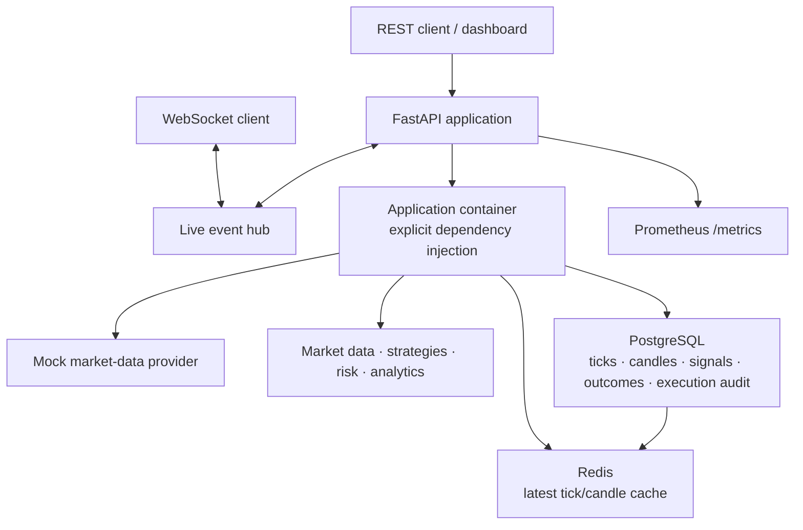

# Intraday Signal Platform

A Python 3.12 FastAPI backend for US equities market data, strategy evaluation, portfolio risk controls, and configurable Alpaca execution.

The deterministic mock market-data provider makes local development safe without broker credentials. The default local development composition uses bounded in-memory stores; Docker Compose uses PostgreSQL as the durable system of record and Redis to accelerate latest tick/candle reads.

## What it does today

- Normalizes, validates, and stores timestamp-aware market ticks.
- Aggregates XNYS-session candles from `1m` through monthly intervals.
- Prefers provider candle history and safely falls back to tick aggregation.
- Runs isolated strategy plugins; EMA crossover is the first concrete strategy.
- Converts directional intents into ATR-based, position-sized proposals with hard loss limits.
- Calculates realized-outcome analytics after an explicitly supplied close.
- Persists ticks, candles, signals, observed outcomes, automated orders, and account/position snapshots in PostgreSQL.
- Uses Redis only for expiring latest-value cache entries; Redis loss never represents loss of trading history.
- Runs a bounded, symbol-sharded worker pipeline: tick → completed candle → EMA/ATR → portfolio risk → idempotent execution audit → broker order.
- Exposes backend account, holdings, execution, and P/L inputs at `/trading/*` for the future dashboard.
- Exposes REST endpoints, interactive OpenAPI documentation, Prometheus metrics, and WebSocket topics.

## Signal lifecycle

```mermaid
flowchart LR
    A["Market tick"] --> B["Tick processor\nvalidate · normalize · order check"]
    B --> C["XNYS candle engine\ncompleted-candle aggregation"]
    C --> D["Strategy engine\nEMA crossover"]
    D --> E["Strategy intent\nBUY · SELL · EXIT · HOLD"]
    E --> F["Risk engine\nATR stop · sizing · daily limits"]
    F --> G["Risk-managed signal\nno order execution"]
    G --> H["Signal history + REST/WebSocket"]
    H --> I["Explicit closed outcome"]
    I --> J["Analytics\nP&L · drawdown · R multiples"]
```



The candle engine only updates strategies from completed candles. The tick processor rejects timestamp-regressing events by default, and the risk engine blocks averaging down, daily-loss breaches, and consecutive-loss breaches.

## Application architecture



The application container owns all runtime dependencies. In-memory stores are an explicit development/test option; setting `TRADING_STORAGE_BACKEND=postgres` selects the durable repositories.

## Trading modes and safety

`paper` is the default mode. It uses the selected provider's paper credentials and can be automated only after all of these configuration values are set:

```dotenv
TRADING_ORDER_SUBMISSION_ENABLED=true
TRADING_AUTOMATION_ENABLED=true
TRADING_AUTOMATION_CONFIRMATION=ENABLE_PAPER_AUTOMATION
TRADING_SYMBOLS=AAPL,MSFT
```

Live trading is intentionally harder to activate. Set `TRADING_TRADING_MODE=live`, use separate live Alpaca credentials, and supply both `ENABLE_LIVE_TRADING` and `ENABLE_LIVE_AUTOMATION` confirmations. Alpaca uses different credentials for paper and live accounts. [Alpaca authentication documentation](https://docs.alpaca.markets/us/v1.1/docs/authentication-1)

Keep `TRADING_AUTOMATION_ENABLED=false` while validating a configuration. Signals are still generated and persisted, but no broker order is submitted.

## Quick start

Prerequisites: [uv](https://docs.astral.sh/uv/) and Python 3.12. The project lockfile pins all Python dependencies.

```powershell
uv sync --all-groups --python 3.12
uv run --python 3.12 uvicorn api.app:app --host 127.0.0.1 --port 8000
```

Open these URLs once the server starts:

- Interactive API: http://127.0.0.1:8000/docs
- Health: http://127.0.0.1:8000/health
- Readiness: http://127.0.0.1:8000/ready
- Prometheus metrics: http://127.0.0.1:8000/metrics

### Verify the service

```powershell
Invoke-WebRequest -UseBasicParsing http://127.0.0.1:8000/health
```

Expected response:

```json
{"status":"ok"}
```

## Docker

Copy the environment template and start the containerized API:

```powershell
Copy-Item .env.example .env
docker compose up --build
```

The API is available on port `8000`; Redis is published at `6379`. PostgreSQL is hosted outside Docker (for example, the local instance managed through pgAdmin). Configure `TRADING_DATABASE_URL` in `.env`; Docker Desktop reaches a host-local database through `host.docker.internal`. The API waits for Redis, applies the Alembic migration automatically, and then starts. The Redis named volume persists across normal `docker compose down` operations.

Stop it with:

```powershell
docker compose down
```

Use `docker compose down -v` only when deliberately discarding the local Redis cache data. It does not remove the externally managed PostgreSQL database.

## REST API

| Method | Endpoint | Purpose |
| --- | --- | --- |
| `GET` | `/health` | Liveness check. |
| `GET` | `/ready` | Readiness check for the market-data pipeline, PostgreSQL, and Redis. |
| `GET` | `/metrics` | Prometheus metrics. |
| `GET` | `/market/status` | Provider and application connection status. |
| `POST` | `/market/ticks` | Validate, store, and aggregate one tick. |
| `GET` | `/market/ticks/latest/{symbol}` | Latest accepted tick. |
| `GET` | `/market/candles/latest/{symbol}?interval=1m` | Latest active or completed candle. |
| `GET` | `/market/candles/{symbol}` | Historical provider candles or safe tick fallback. |
| `POST` | `/signals/generate` | Risk-check a strategy intent and create a signal proposal when approved. |
| `GET` | `/signals` | Generated risk-managed signal history. |
| `POST` | `/analytics/outcomes` | Record an observed close for a generated signal. |
| `GET` | `/analytics` | Overall and periodized realized analytics. |
| `GET` | `/trading/status` | Effective mode, configured providers, symbols, and worker state. |
| `GET` | `/trading/account` | Current account capital and daily P/L inputs. |
| `GET` | `/trading/positions` | Current holdings with unrealized P/L. |
| `GET` | `/trading/orders` | Durable automated execution audit trail. |

All REST responses include `X-Request-ID`. Supply `X-Request-ID` and `X-Correlation-ID` headers to preserve external tracing identifiers in structured JSON logs.

### Example: ingest a tick

```powershell
$tick = @{
  timestamp = "2026-07-24T13:30:00Z"
  received_at = "2026-07-24T13:30:00.002Z"
  symbol = "AAPL"
  exchange = "NASDAQ"
  price = "200.00"
  bid = "199.99"
  ask = "200.01"
  volume = "1000"
  trade_size = "100"
} | ConvertTo-Json

Invoke-RestMethod http://127.0.0.1:8000/market/ticks -Method Post -ContentType "application/json" -Body $tick
```

## Live WebSocket topics

Connect to exactly one topic per socket:

| URL | Event source |
| --- | --- |
| `ws://127.0.0.1:8000/ws/ticks` | Accepted REST tick ingestion. |
| `ws://127.0.0.1:8000/ws/candles` | Candle updates and completed candles. |
| `ws://127.0.0.1:8000/ws/signals` | Risk decisions from signal generation. |
| `ws://127.0.0.1:8000/ws/analytics` | Analytics snapshot after an outcome is recorded. |

Every message has this envelope:

```json
{
  "event": "tick",
  "data": {}
}
```

## Configuration

Copy `.env.example` to `.env` and adjust the `TRADING_` variables. Set `TRADING_STORAGE_BACKEND=postgres` together with an async SQLAlchemy `TRADING_DATABASE_URL` and `TRADING_REDIS_URL` for durable deployment. Use `memory` only for isolated development/tests. For Docker Desktop, use `host.docker.internal` in the database URL; use `localhost` only when running the API directly on the host.

Use `mock` providers for local deterministic testing. To use Alpaca without code changes, set both provider names to `alpaca`, add the appropriate keys, set `TRADING_SYMBOLS`, then choose the paper or explicitly guarded live mode. The SDK's stock stream subscribes to trade and quote WebSocket events; the application discards trades until it has a contemporaneous quote rather than inventing bid/ask values. [Alpaca real-time data documentation](https://alpaca.markets/sdks/python/api_reference/data/stock/live.html)

## Development and verification

Run all lint and tests:

```powershell
.venv\Scripts\python.exe -m ruff check .
.venv\Scripts\python.exe -m pytest
```

The current suite covers tick validation/order handling, XNYS candle aggregation, provider fallback, strategy lifecycle and EMA signals, risk rules, realized analytics, REST workflows, WebSocket broadcasts, request-correlation/error paths, and SQLite-backed durable repository round trips. Compose additionally validates the production PostgreSQL migration at startup.

## Current scope and planned expansion

This repository is a tested application foundation, not yet the full institutional deployment described in the original roadmap. The following are intentionally still pending:

- The remaining requested strategy implementations beyond EMA crossover.
- Authentication, authorization, deployment secrets, broker trade-update reconciliation, Redis-backed multi-process WebSocket fan-out, and production observability backends.

Automatic execution remains disabled until enabled through the guarded environment settings above.
