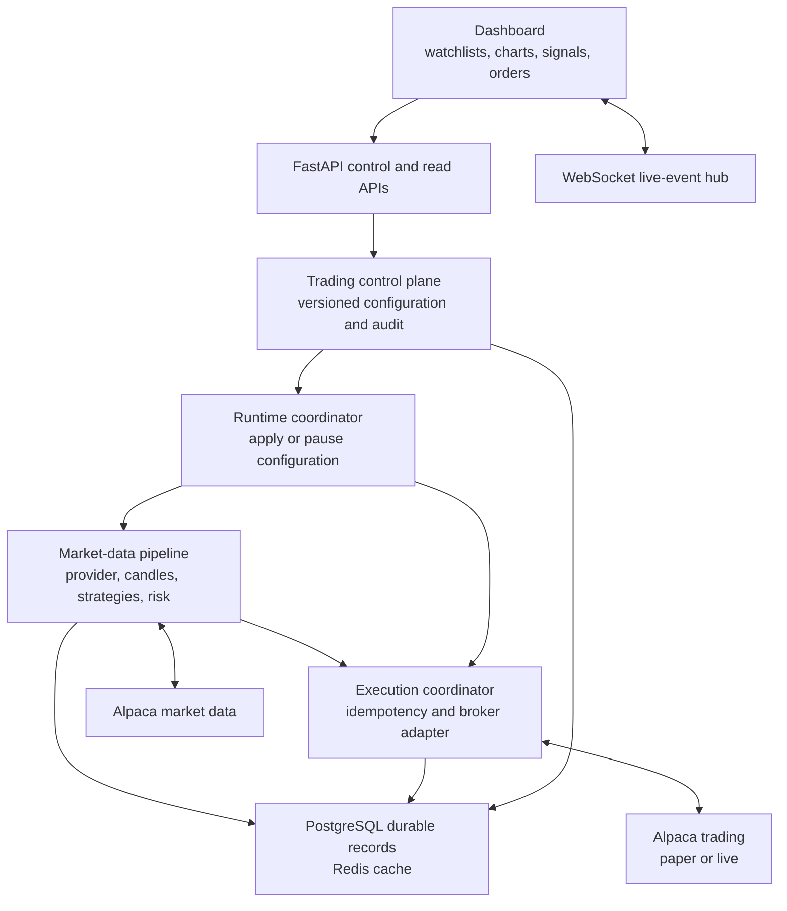
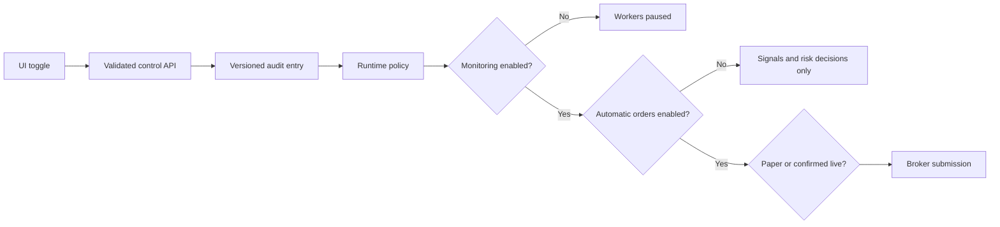

# Product architecture

## Goal

The platform is a local-Docker deployable trading application with a browser control surface. Operators configure watchlists, strategies, risk limits, paper/live mode, and automatic-order placement through the application. Infrastructure addresses and credentials remain deployment-only secrets.

## Component design

| Component | Responsibility | Does not own |
| --- | --- | --- |
| Dashboard | Operator controls and at-a-glance status | Credentials or broker policy bypasses |
| Control plane | Versioned operating configuration, validation, audit | Raw market processing |
| Runtime coordinator | Applies validated configuration to workers and strategies | Persistence authority |
| Market pipeline | Ticks, candles, strategies, signals, and risk decisions | User configuration storage |
| Execution coordinator | Idempotent broker submission and portfolio reads | Strategy selection |
| PostgreSQL | Durable source of truth | Ephemeral latest-value caching |
| Redis | Reconstructible cache | Orders, signals, or audit authority |

## Safety boundaries

The UI is not a security boundary. The backend validates configuration, records it, requires explicit confirmations for automatic and live operation, and remains the only code path able to submit orders.

## Delivery phases

1. **Control plane and dashboard foundation:** persisted watchlist/EMA/risk configuration, paper/live selector, automatic-order toggle, monitoring state, audit trail, and operator dashboard.
2. **Market intelligence:** historical charting, indicator warm-up, replay/backtesting, scanner/watchlist ranking, and news/event context.
3. **Execution productionization:** order/fill reconciliation, bracket protection, persistent kill switch, restart recovery, and execution alerts.
4. **Deployment hardening:** authentication, secret manager, TLS, backups, CI/CD, worker ownership, monitoring, and live go/no-go controls.

## Runtime configuration contract

`RuntimeTradingConfiguration` is the single persisted operator configuration. It contains:

- `mode`: `paper` or `live`.
- `place_orders_automatically`: user-visible toggle, default `false`.
- `monitoring_enabled`: start/pause market watch.
- `symbols`: normalized watchlist.
- `strategy`: selected strategy and validated parameters.
- `risk_policy`: the same immutable policy evaluated by every proposed entry.

Secrets, database URLs, provider selection, and deployment constraints remain in `.env` or a production secret manager and are never exposed in the dashboard API.
